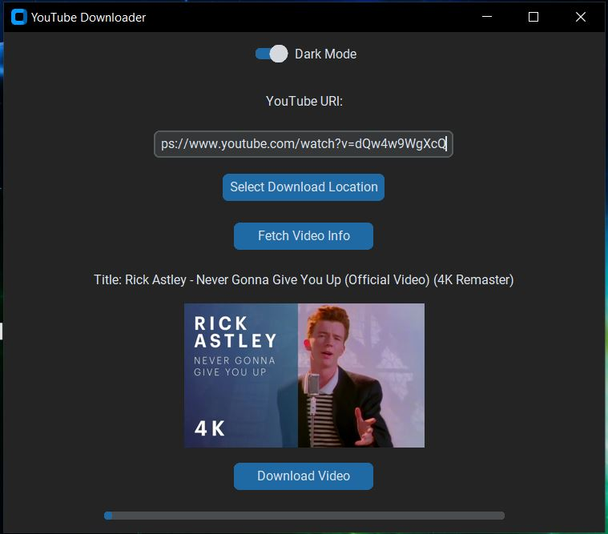
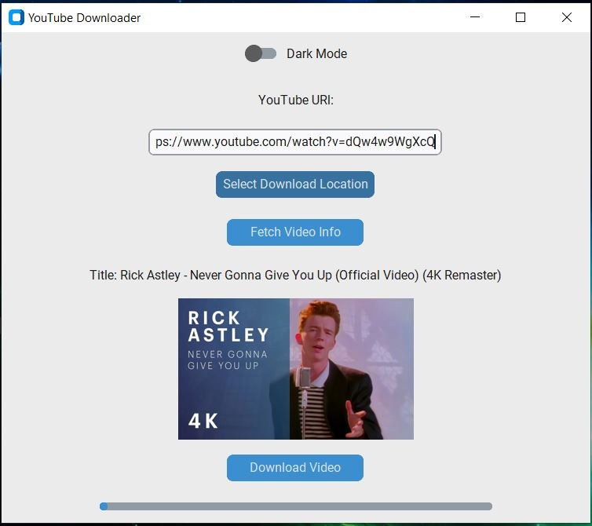

# YouTube Downloader GUI 🎥📥

A simple desktop YouTube video downloader built with Python, CustomTkinter, and yt_dlp.  
This is **version 1.0**, which supports:
- Entering a YouTube video URL.
- Previewing the title and thumbnail.
- Selecting a download folder.
- Downloading the video in best available format (up to 1080p).
- Progress bar for download feedback.
- Dark/light mode switch.

---

## 🚀 Getting Started

### 🔧 Requirements

- Python 3.8 or later
- pip

### 📦 Installation

1. **Clone the repository:**
   ```bash
   git clone https://github.com/yourusername/youtube-downloader.git
   cd youtube-downloader
   
2. **Install dependencies:**
    ```bash
    pip install -r requirements.txt

3. **Run the app:**
    ```bash
    python main.py

---
## 📁 Features
- ✅ Fetch video metadata (title & thumbnail)

- ✅ Download in 1080p or highest available resolution

- ✅ Graphical interface (CustomTkinter)

- ✅ Dark/Light theme toggle

- 🚧 (Coming in v1.1) Open downloaded file in folder

---

### Project Structure

   ```css
   youtube-downloader/
   │
   ├── Screenshots/
   │  ├── Screenshots_dark.JPG
   │  └── Screenshots_light.JPG
   ├── main.py
   ├── README.md
   ├── requirements.txt
   └── .gitignore
```

---
### 🛠 Dependencies
See requirements.txt for details.

---

### 📷 Preview

- **Dark mode**



- **Light mode**


---

### 📌 TODO (v1.1 and beyond)
- Open downloaded file's location.

- Audio-only download option.

- Quality selector.

- Video preview panel.

---

### 📝 License
This project is open-source and free to use.

---

## 📦 `requirements.txt`

This file lists all the libraries used:

```txt
customtkinter
yt-dlp
pillow